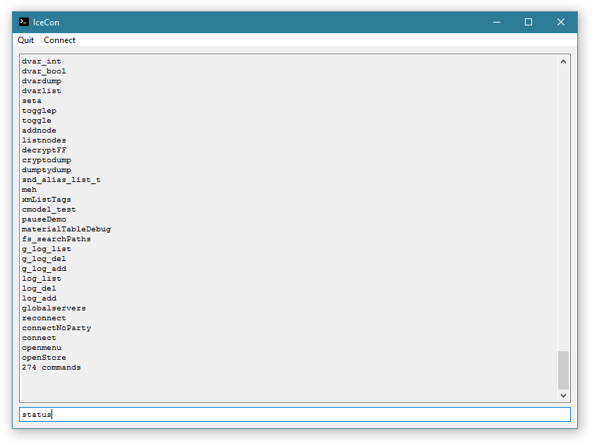
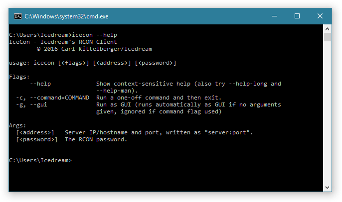

#  IceCon RCON client

*IceCon* is a Q3-compatible RCON client. It can connect to any server that implements RCON over a Q3-compatible network protocol (UDP) and even comes with a nice, straight minimal GUI.

Specifically, this tool has been written for quick administration of modified Modern Warfare 2 ("IW4M") servers. A Windows user could easily set up shortcuts on the desktop that run `icecon.exe -gui <server:port> <password>` which gives you an instant GUI to run commands on your server. Another use case would be scripting on a Linux server by running `icecon -command "<your command here>" <server:port> <password>` to automate specific tasks.

## Download

### Binaries

Binaries for all releases for Linux and Windows are always available on the [GitHub releases page](https://github.com/icedream/icecon/releases).

### Source code

You can download the source code from GitHub, either via Git (`git clone https://github.com/icedream/icecon.git`) or as a source code archive via the "Download ZIP"/"Download TAR.GZ" button at the top right of the [GitHub project page](https://github.com/icedream/icecon).

## Compiling from source code

In most cases, simply installing [Go 1.6 or newer](http://golang.org) and running `go build -i -v .` will give you a single binary that contains everything you need to run *IceCon*.

If you need to regenerate the UI code files (`*_ui.go`) and/or the Windows resource data (`rsrc_windows.syso`), make sure to follow these steps:

- Set up a `GOPATH` as environment variable that points to an existing folder. This folder will be used by Go to store compiled libraries and installed binaries which will be needed for the next step.
- Ensure you have `$GOPATH/bin` (`%GOPATH%\bin` on Windows) included in your `PATH` environment variable.
- Install needed tools and dependencies via `go get -v -u github.com/icedream/ui2walk github.com/josephspurrier/goversioninfo/cmd/goversioninfo`.
- Run `go generate -v` in the *IceCon* source code folder.

You should now be able to run a normal `go build` to get your desired binary.

## License

This project is licensed under the **GNU General Public License Version 2 or any later version**. For more info, see the [COPYING](COPYING) text file.
